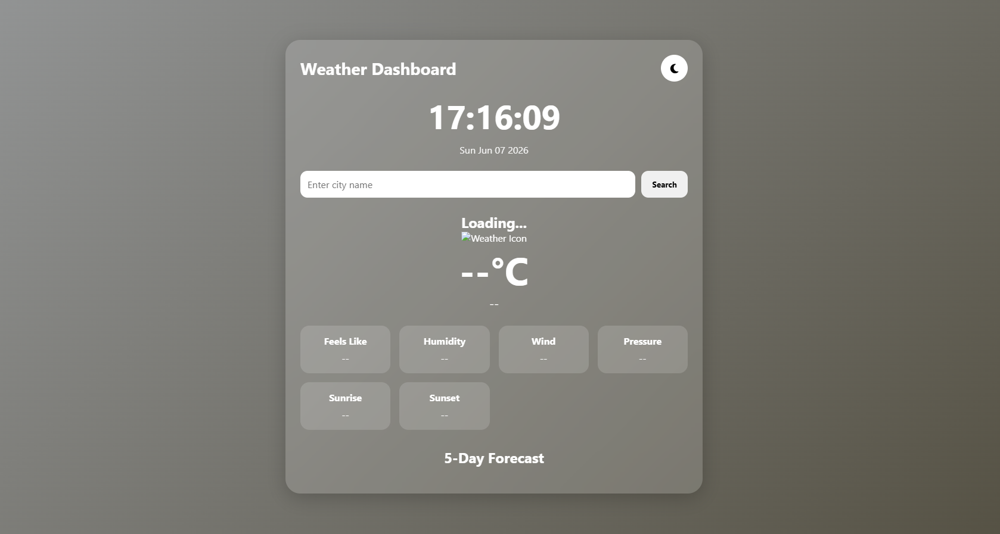
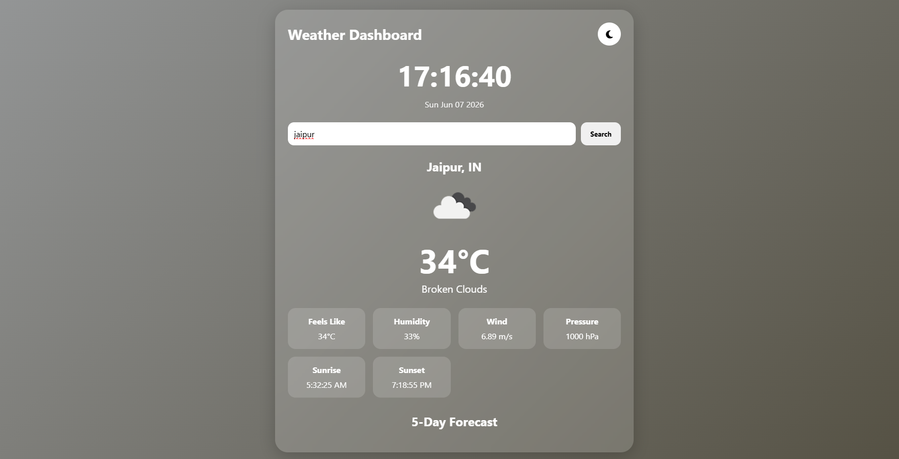

# Weather App 🌦️

A modern Weather Application built using HTML, CSS, and JavaScript. The application allows users to search for weather information of any city and displays real-time weather data fetched from the OpenWeather API. It also includes a live digital clock, current date display, dark mode toggle, weather icons, and a responsive user interface for a better user experience.


## Features

✅ Search weather by city name

✅ Real-time weather data using OpenWeather API

✅ Current temperature display

✅ Weather condition with dynamic icon

✅ Feels Like temperature

✅ Humidity information

✅ Wind speed details

✅ Atmospheric pressure display

✅ Sunrise and Sunset timings

✅ Real-Time Digital Clock

✅ Current Date Display

✅ Dark Mode / Light Mode Toggle

✅ Dynamic User Interface

✅ Responsive Design

✅ Fast and Easy Search Functionality

---

## Screenshots

### Home Page



### Weather Information



---

## Technologies Used

* HTML5
* CSS3
* JavaScript (ES6)
* OpenWeather API

---

## Project Structure

```text
Weather-App/
│
├── weather.html
├── weather.css
├── script.js
├── README.md
│
└── screenshots/
    ├── home-page.png
    └── weather-result.png
```

---

## How to Run the Project

1. Clone the repository:

```bash
git clone https://github.com/Shivang9983/GNCIPL-Whether-project.git
```

2. Open the project folder.

3. Open `weather.html` in your browser.

4. Enter a city name and click the Search button.

5. View real-time weather details.

---

## API Used

OpenWeather API

https://openweathermap.org/api

---

## Learning Outcomes

Through this project, I learned:

* Working with REST APIs
* Using JavaScript Fetch API
* Handling asynchronous operations with async/await
* DOM manipulation
* Event handling
* Responsive web design
* Git and GitHub project management

---

## Future Enhancements

* 5-Day Weather Forecast
* Air Quality Index (AQI)
* Weather-based background animations
* Multiple language support
* Location-based weather search
* Weather maps integration

---

## Author

**Shivang**

GitHub: https://github.com/Shivang9983

---

## License

This project is developed for educational and learning purposes.
